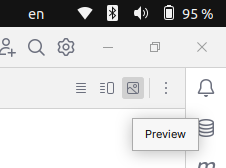

# 🚀 Desafio de Programação: POC para E-commerce

## 🌟 Contexto
Uma startup precisa desenvolver uma **Prova de Conceito (POC)** para um e-commerce. O desafio é **resolver problemas de código utilizando Java**.

## 📚 Classes e Especificações

### Classe `Produto`
#### Atributos
- `codigoBarra`: String
- `nome`: String
- `descricao`: String
- `categoria`: String
- `preco`: Double
- `quantidade`: int

#### Métodos
- `calcularPrecoUnitario()`: Double
- `calcularPrecoTotal()`: Double

#### Encapsulamento
- Todos os atributos são privados.
- Métodos de acesso e modificação para cada atributo.

#### Construtores
- Construtor que recebe todos os atributos.

---

### Classe `ProdutoNacional`
#### Atributos
- `estadoOrigem`: String

#### Métodos
- `calcularPrecoUnitario()`: Double - Retorna o próprio preço.
- `calcularPrecoTotal()`: Double - Preço total é preço * quantidade.

---

### Classe `ProdutoInternacional`
#### Atributos
- `TAXA_IMPORTACAO`: double (público, estático, constante, valor = 1.6)
- `paisOrigem`: String

#### Métodos
- `calcularPrecoUnitario()`: Double - Preço com taxa de importação.
- `calcularPrecoTotal()`: Double - Preço total com taxa de importação.

---

### Classe `Carrinho`
#### Atributos
- `produtos`: `List<Produto>

#### Métodos
- `adicionarProduto(Produto produto)`: void - Adiciona produto, sem repetir código de barras.
- `removerProduto(int indice)`: void - Remove produto pelo índice.
- `obterProduto(int indice)`: Produto - Retorna produto pelo índice, ou null se não existir.
- `buscarPorCategoria(String categoria)`: `List<Produto>`
- `buscarProdutosInternacionais()`: `List<ProdutoInternacional>`
- `buscarProdutosNacionais()`: `List<ProdutoNacional>`
- `calcularTotalEmEstoque()`: Double
- `calcularTotalEmEstoquePorCategoria(String categoria)`: Double
- `buscarPorPaisOrigem(String paisOrigem)`: `List<ProdutoImportado>`
- `existeProdutoPorCodigoBarra(String codigoBarra)`: boolean
- `existePorIndice(int indice)`: boolean

## ⚠️ Observações
- Não é necessário usar try/catch ou lançar exceções.
- A prova inclui testes unitários, então não é preciso implementar um método `main`.
- Não é necessário implementar o método `toString()` nas classes.
- Consulta ao material de aula é permitida.
- Duração total: 2 horas.
- Em caso de cola, a prova será zerada.

## **Entregue o projeto inteiro zipado, não utilize o IntelliJ para compactar!!! Faça isso manualmente pelo explorador de arquivos do Sistema Operacional.**

**_ps. Logo ali em cima, no canto superior direito, tem um botão chamado preview, clique nele para ver o arquivo formatado._**

# 🎓 Boa sorte!
